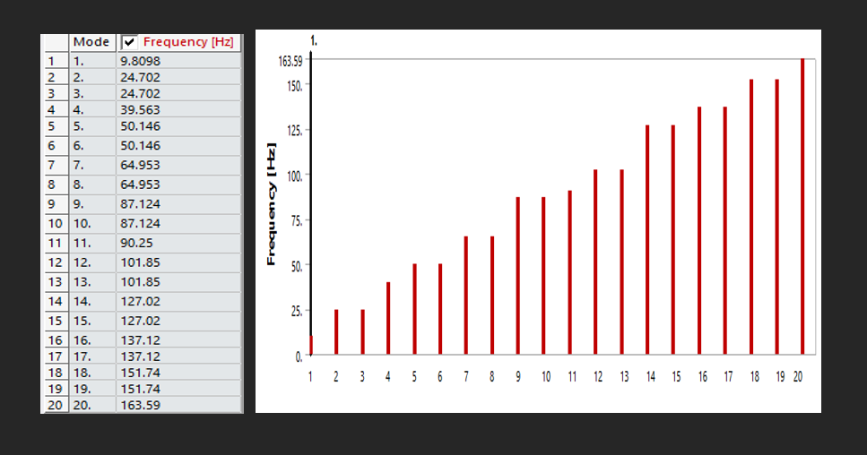
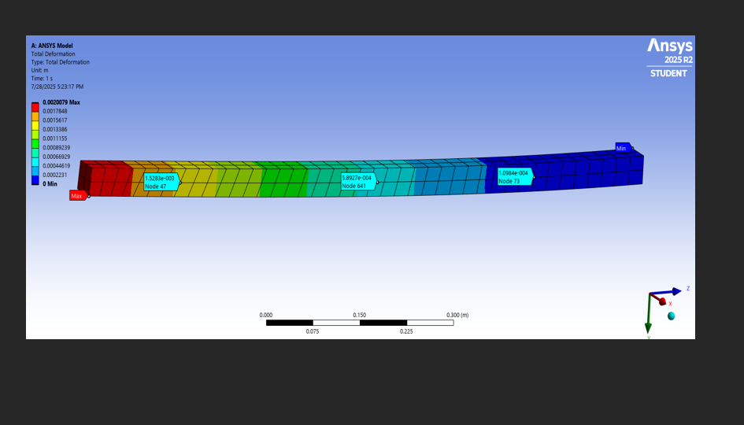
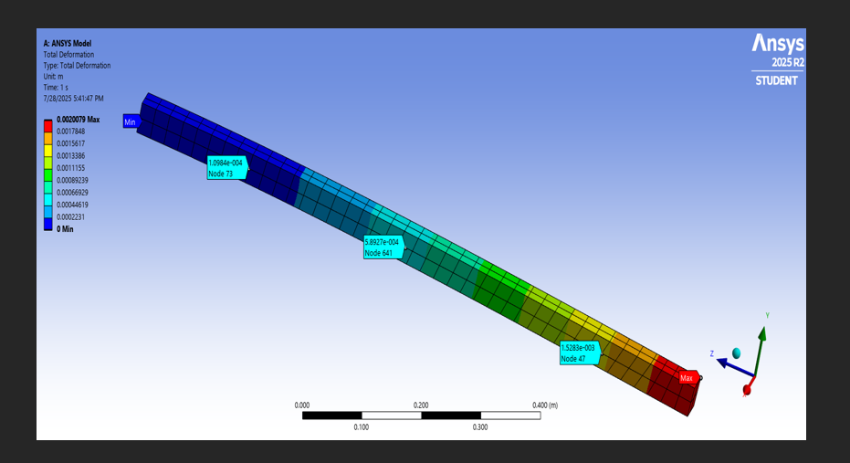
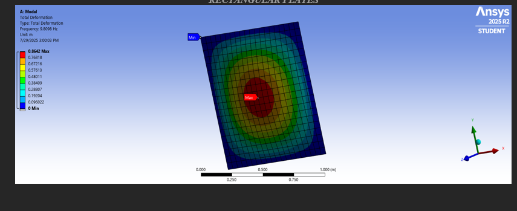
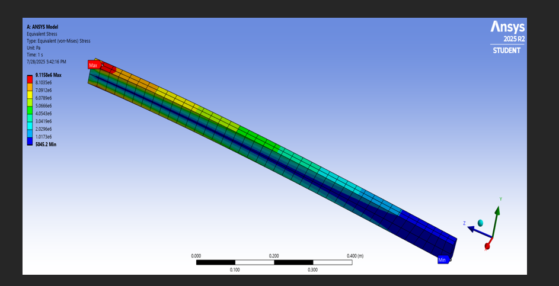
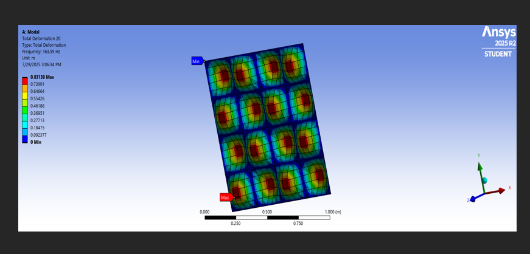
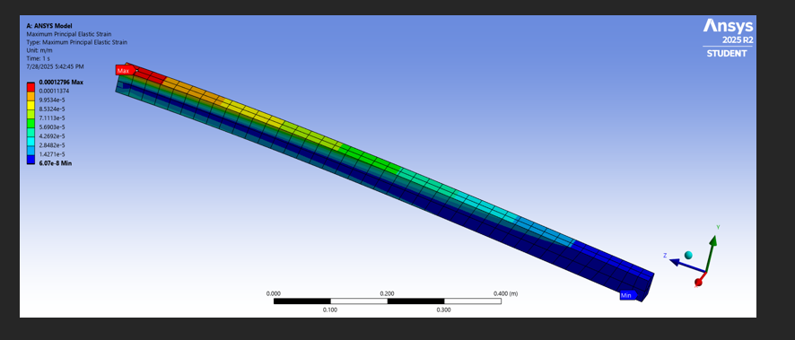
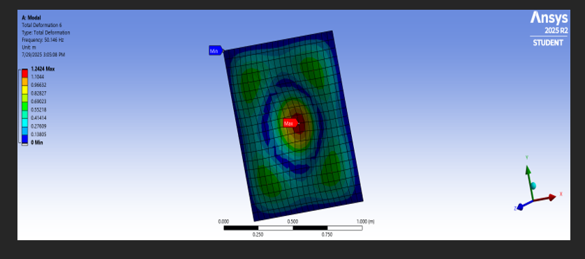
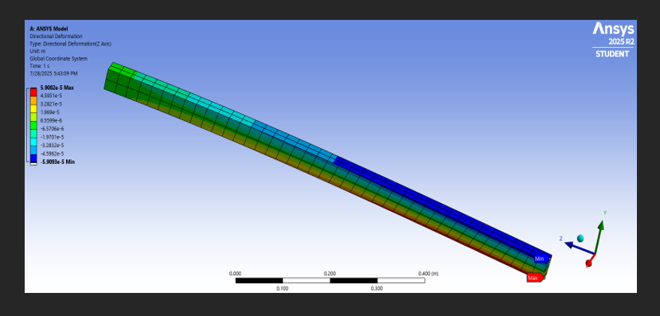
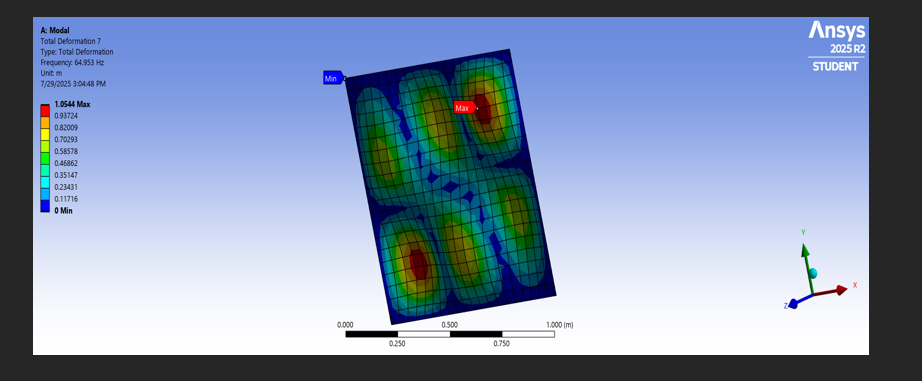

# Acoustic Metamaterials for Vibration Reduction using ANSYS

Finite element investigation of low-frequency vibration behaviour in aluminium beam and plate structures using ANSYS Workbench, with a focus on acoustic metamaterials (AMMs) and dynamic vibration absorbers (DVAs).

The project explores how locally resonant vibration-control concepts can influence natural frequencies, structural mode shapes, harmonic response and deformation in lightweight structures, with particular relevance to automotive NVH applications.

## Engineering Problem

Lightweight structural panels can be susceptible to low-frequency vibration generated by road, powertrain and other dynamic excitation.

Conventional vibration-control approaches can require additional mass, while acoustic metamaterials use locally resonant structures to influence vibration transmission over selected frequency ranges.

This project investigates the feasibility of applying simplified acoustic metamaterial and dynamic vibration absorber concepts to aluminium structures using finite element simulation.

## Project Objectives

- Investigate acoustic metamaterials for low-frequency vibration attenuation
- Develop finite element models of aluminium beam and plate structures
- Determine natural frequencies and structural mode shapes
- Perform harmonic-response analysis across a broad frequency range
- Investigate locally resonant mass-spring vibration-control concepts
- Evaluate deformation, stress and strain behaviour
- Assess model reliability using mesh refinement and analytical comparison
- Explore potential automotive NVH applications

## Simulation Approach

The project was developed using ANSYS Workbench and included:

- Geometry development
- Material-property definition
- Finite element meshing
- Boundary-condition definition
- Modal analysis
- Harmonic-response analysis
- Frequency-response evaluation
- Mesh-refinement studies
- Deformation analysis
- Equivalent von Mises stress analysis
- Principal strain analysis
- Directional deformation analysis

## Structures Investigated

### Aluminium Beam

A cantilever beam configuration was used to investigate structural bending modes and dynamic response.

### Aluminium Plate

A thin rectangular aluminium plate with supported boundaries was investigated as a simplified representation of lightweight engineering panels such as automotive floor structures.

## Material

Aluminium was used as the primary structural material with:

- Young's modulus: **70 GPa**
- Density: **2700 kg/m³**
- Poisson's ratio: **0.33**

## Analysis Types

### Modal Analysis

Modal analysis was performed to identify:

- Natural frequencies
- Structural mode shapes
- Resonant behaviour of the beam and plate models

The beam model was assessed over a frequency range up to approximately 1000 Hz, while the plate model focused on low-frequency bending modes up to approximately 500 Hz.

### Harmonic Response

Harmonic-response analysis was used to investigate the structural response under variable-frequency excitation.

The study considered:

- Resonance peaks
- Frequency-response behaviour
- Structural displacement
- Anti-resonance regions
- Potential vibration attenuation using AMM and DVA concepts

A 1 N off-centre harmonic point load was used in the simulation methodology to excite the structures across a broad frequency range.

### Structural Response

Additional post-processing included:

- Total deformation
- Equivalent von Mises stress
- Maximum principal strain
- Directional deformation

These results were used to identify regions of high displacement, stress and strain under dynamic loading.

## Simulation Results

### Modal Analysis Results

Modal analysis was used to determine the natural frequencies and corresponding mode shapes of the aluminium beam and plate models.

The results were used to identify resonant behaviour and provide a basis for evaluating vibration-control strategies using acoustic metamaterials and dynamic vibration absorbers.

### Total Deformation

Total deformation was evaluated to identify the locations experiencing the greatest structural displacement under the simulated loading conditions.

#### Beam

The cantilever beam showed its highest deformation toward the free end, consistent with its boundary conditions and bending behaviour.

#### Plate

The simply supported plate showed its largest deformation around the central region of the structure.

### Equivalent von Mises Stress

Equivalent von Mises stress was evaluated to identify regions of elevated stress and assess structural response under the applied dynamic loading.

#### Beam

The beam showed its highest stress concentration near the fixed end, where bending stresses are expected to be greatest.

#### Plate

The plate stress distribution was evaluated to identify areas of maximum structural loading under the simulated excitation.

## Additional Structural Results

Further ANSYS post-processing included maximum principal strain and directional deformation for both the beam and plate models.

These outputs were retained in the repository as additional evidence of the finite element post-processing and structural-response assessment.

### Maximum Principal Strain

#### Beam

#### Plate

### Directional Deformation

#### Beam

#### Plate

## Model Verification

Model reliability was assessed using:

- Mesh-refinement studies
- Natural-frequency convergence checks
- Boundary-condition verification
- Analytical comparison using classical beam and plate vibration theory
- Comparison with relevant published studies

The dissertation reports that further mesh refinement produced less than approximately 1% variation in the monitored natural frequencies.

The first natural frequency of the simply supported plate was also reported to agree with the corresponding analytical prediction within approximately 3%.

## Study Limitations

The project was simulation-based and used idealised material properties, geometry and boundary conditions.

Experimental validation was outside the scope of the study. Further work would therefore benefit from physical modal testing, correlation of experimental and numerical frequency responses, and additional optimisation of AMM and DVA parameters.

## Automotive Relevance

The project is relevant to lightweight NVH-sensitive structures including:

- Vehicle floor panels
- Body panels
- Cabin structural panels
- Other lightweight automotive components

Acoustic metamaterial concepts offer a potential approach to targeted low-frequency vibration control while limiting dependence on conventional mass-based damping treatments.

## Tools and Methods

- ANSYS Workbench
- Finite Element Analysis
- Modal Analysis
- Harmonic Response Analysis
- Structural Dynamics
- Vibration Analysis
- Acoustic Metamaterials
- Dynamic Vibration Absorbers
- Frequency Response Functions
- Mesh Convergence
- NVH Engineering

## Project Type

Individual MSc Automotive Engineering dissertation project.
